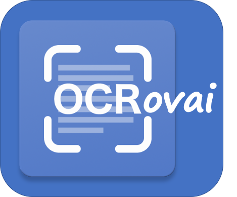

 <h1> OCRovai </h1>
<h3> Web App for OCR using Python Tesseract (pytesseract) </h3>

Developed by MJ Rovai @ June, 1 2020 
<h3>Introduction</h3>
This web app was developed in Flask and based on pytesseract, a wrapper for Google's Tesseract-OCR Engine. Python-tesseract is an optical character recognition (OCR) tool for python, that recognize and "read" the text embedded in images.

The final app is deployed in Heroku:
 - https://ocrovai.herokuapp.com
